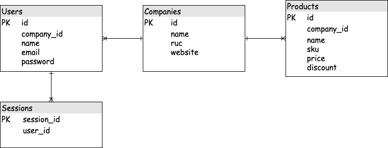

Frontend Challenge - EquipIndustry
==================================

.. contents:: Table of Contents:
    :local:

This is a placement test. We would like to clarify that we don't expect
everyone to fullfill it in its whole since it is meant for every career
level. We hope all the people who would like to work with us make an
attempt.

In this challenge, we focus on code design and design patterns in
Javascript. The goal is to assess your experience in writing **code that
is easy to maintain, loosely coupled and highly cohesive**.

EquipIndustry likes to work with constructive feedbacks, therefore we will
pay special attention to everyone's solution. We will contact you about
the positive aspects of your test, as well as what you could improve in
it. It is worth trying! :)

The problem
-----------

For this challenge you will be creating highly simplified version of the
web app using `ReactJS`_. This is a Frontend challenge,
You should use Git as you build your solution. For submission you are asked to push your repo
to GitHub and provide us with the link and any necessary instructions.

Your app is to have three models: users, company, and product. Your
database should closely resemble the following `entity-relationship
diagram <https://en.wikipedia.org/wiki/Entity%E2%80%93relationship_model#Crow's_foot_notation>`__:

Expected functionalities
~~~~~~~~~~~~~~~~~~~~~~~~

The following illustrations should only serve as an example. You do not
need to follow the designs presented below. You can split functionality
out to other pages. Just make sure it is all there.

An unauthenticated user should first be prompted to log in, sign up, or
reset their password:

Figure 2:

As per Figure 1, users have names, so "Name" should be a field on your
sign up page.

Figure 3:

After signing up, users will not belong to an company, so when they
log in for the first time, they should be prompted to join an
company (or create a new one).

Figure 4:

Users should be able to edit all companies (i.e. their names and
others).

Figure 5:

Once a user has joined an company, the home page should change to
become an overview of actions for that company: viewing products,
editing the company, or leaving the company.

Figure 6:

Leaving an company should return the user to the state they are in
just after they sign up, i.e. not belonging to any organisations. The
departed user's product should be deleted.

Finally, the product page should show all product that belong to the company.

Optional exercises
~~~~~~~~~~~~~~~~~~

Here are some optional exercises for you to do. We recommend that you
try at least one of them. They are all mutually compatible, so you could
do all of them.

1. Users details (easy)
^^^^^^^^^^^^^^^^^^^^^^^

Allow users to change their own name, email address, or password.

2. Modifying/Deleting products (easy)
^^^^^^^^^^^^^^^^^^^^^^^^^^^^^^^^^^^^^

Allow users to modify or delete existing products.

3. Filtering products (medium)
^^^^^^^^^^^^^^^^^^^^^^^^^^^^^^

Allow users to filter which product are visible.

4. Unit tests
^^^^^^^^^^^^^

Unit tests are a good idea. We don't mandate that you write any for this
challenge, but feel free to go ahead and write some tests for your code.

5. Your own idea
^^^^^^^^^^^^^^^^^

Feel free to add a feature of your own devising.

Challenges to achieve
---------------------

For this challenge you will be writing your own
`ReactJS`_ `Single Page App`_

This is a React challenge, and is not strictly design focused, however,
if you'd like to build and style your own components, please go right
ahead. If you're not interested or comfortable with doing that, there
are plenty of component libraries to help you. `Semantic
UI <https://semantic-ui.com/>`__ is a good choice. Additionally, feel
free to use any additional libraries you find valuable.

You should use Git as you build your solution. For submission you are
asked to push your repo to GitHub and provide us with the link and any
necessary instructions.

Your solution should allow you to perform all of the same actions.
Please have a read through `the readme`_ to understand more about the tasks to be completed. For this challenge
you will be consuming an existing JSON REST API
represented as a JSON API. To setup the backend and start the server,
navigate to the root of the repository and run ``yarn backend:setup``.
To start the backend server, navigate to the root of the repository and
run ``yarn backend:start``, it will start listening on port 3000
locally, your React SPA should be making requests to it to create, read,
update and delete data.

The backend uses a SQLite database to store the data generated by your
React application. If you’d like to reset the data, just delete the
``backend/db.db`` file and restart the server.

Please read the `endpoint documentation`_
for information on the specific requests and responses for the
endpoints, and how authentication should work. You’re welcome to extend
the functionality of the backend server, however heavily modifying
existing logic is discouraged.

Your solution should compile to a single HTML page, and a bundled JS
file, you can use any build tools you’d like.
`Webpack`_ is not a bad choice.

Development
-----------

Prerequisite
~~~~~~~~~~~~

You'll need to have at least `NodeJs <https://nodejs.org/en/>`__
installled to run the application and
`Git <https://git-scm.com/book/en/v2/Getting-Started-Installing-Git>`__
installled to clone the repository and submit a pull request.

Configuration to run the environment
~~~~~~~~~~~~~~~~~~~~~~~~~~~~~~~~~~~~

You need to know a little of Git, which is the tool that helps us
controlling our files' versioning.

.. code:: shell

    git clone https://github.com/equipindustry/challenge.git
    cd frontend/

.. code:: shell

    yarn backend:setup
    yarn backend:start

If everything is correct, access the following URL:
http://localhost:3000/.

Feedback (optional)
-------------------

Here at EquipIndustry feedbacks are part of our culture, so it would be very
rewarding if you could contribute with our hiring process by giving us
your opinions on the challenge. We would like you to send it even if you
didn't finish the challenge.

|beacon|

.. Links
.. _`Webpack`: https://webpack.js.org
.. _`ReactJS`: https://reactjs.org
.. _`Single Page App`: https://en.wikipedia.org/wiki/Single-page_application
.. _`the readme`: backend/README.rst
.. _`endpoint documentation`: backend/README.rst

.. Footer:
.. |beacon| image:: https://ga-beacon.appspot.com/UA-148899399-1/github.com/equipindustry/challenge/frontend/readme
   :target: https://github.com/equipindustry/challenge
